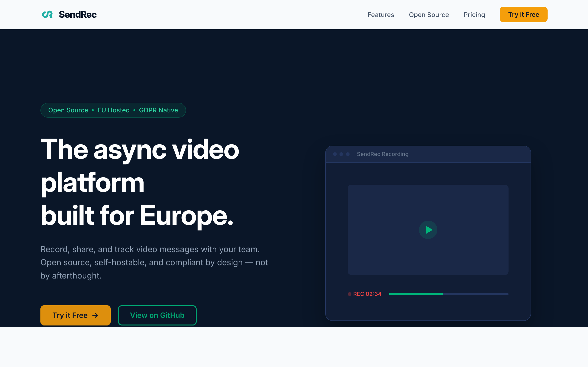

# SendRec

The async video platform built for Europe. Open source, GDPR native, EU hosted.



## What is SendRec?

SendRec is an open-source alternative to Loom for teams that need their data to stay in the EU. Record your screen, share videos with your team, and keep full control of your data.

- **EU hosted** — all data stored on European servers, never leaves the EU
- **GDPR native** — privacy-first by design, not bolted on after the fact
- **Open source** — AGPLv3 licensed, self-host or use our managed platform
- **No US cloud dependency** — no data transfers to the US, no Schrems II risk
- **Screen recording** — pause/resume, camera overlay (PiP webcam), drawing annotations
- **Video management** — trimming, download, library search (title + transcript), playback speed controls
- **Sharing** — expiring links, password protection, video comments with timestamps and emoji
- **Analytics** — per-video view tracking with daily charts and summary stats
- **View notifications** — instant, first-view, or daily digest email notifications when someone watches your video
- **Email confirmation** — new accounts require email verification before access
- **Automatic transcription** — videos are transcribed with whisper.cpp, displayed as subtitles and a clickable transcript panel

## Quick Start

```bash
git clone https://github.com/sendrec/sendrec.git
cd sendrec
cp .env.example .env
docker compose -f docker-compose.dev.yml up --build
```

Open http://localhost:8080, register an account, and start recording.

## Development

**Prerequisites:** Go 1.25+, Node 24+, pnpm, Docker

```bash
# Run the full stack with Docker
make docker-up

# Or run services separately:
make dev-web    # Frontend dev server (port 5173, proxies API to 8080)
make run        # Go server (requires DATABASE_URL, S3 env vars)

# Build everything
make build

# Run tests
make test
```

## Tech Stack

- **Frontend:** React 19, TypeScript 5.9, Vite 7
- **Backend:** Go (single binary, chi router)
- **Database:** PostgreSQL 18
- **Storage:** S3-compatible object storage (MinIO for dev, Hetzner Object Storage for prod)
- **Transcription:** [whisper.cpp](https://github.com/ggerganov/whisper.cpp) (optional, runs server-side)
- **Deployment:** Docker Compose

## Architecture

Single Go binary that:
- Serves the React SPA (embedded at build time)
- Handles REST API requests (`/api/*`)
- Serves interactive API documentation (`/api/docs`)
- Renders server-side watch pages with OpenGraph tags (`/watch/:token`)
- Runs database migrations on startup

Video recordings happen entirely in the browser using `getDisplayMedia` + `MediaRecorder`. Files upload directly to S3 via presigned URLs — the server never touches video bytes.

After upload, the server generates a thumbnail with ffmpeg and enqueues the video for transcription with [whisper.cpp](https://github.com/ggerganov/whisper.cpp). Transcripts are stored as VTT subtitles and a clickable segment panel on the watch page. Transcription is optional — if the whisper model is not available, it is silently skipped.

## Self-Hosting

SendRec runs on a single server with Docker Compose. See the **[Self-Hosting Guide](SELF-HOSTING.md)** for full setup instructions, including:

- Production Docker Compose configuration
- Environment variables reference
- Reverse proxy setup (Caddy example)
- Enabling transcription with whisper.cpp
- Removing usage limits
- Updating and backups

## API Documentation

Interactive API reference is available at [`/api/docs`](https://app.sendrec.eu/api/docs) (powered by [Scalar](https://github.com/scalar/scalar)). The raw OpenAPI 3.0 spec is at [`/api/docs/openapi.yaml`](https://app.sendrec.eu/api/docs/openapi.yaml).

## Deployment

Deployments are automated via GitHub Actions. Three environments are available:

| Environment | URL | Trigger |
|-------------|-----|---------|
| **Preview** | `pr-{N}.app.sendrec.eu` | PR opened/updated (write-access authors only, max 3 concurrent) |
| **Staging** | `staging.app.sendrec.eu` | Push to `main` |
| **Production** | `app.sendrec.eu` | Push a git tag (`v*`) |

### Deploying to production

1. Merge your PR to `main` — staging deploys automatically
2. Verify on `staging.app.sendrec.eu`
3. Tag and push:
   ```bash
   git tag v1.0.0
   git push origin v1.0.0
   ```

Preview environments are cleaned up automatically when the PR is closed.

## License

SendRec is licensed under the [GNU Affero General Public License v3.0](LICENSE).

## Links

- **Website:** [sendrec.eu](https://sendrec.eu)
- **API docs:** [app.sendrec.eu/api/docs](https://app.sendrec.eu/api/docs)
- **Blog:** [sendrec.eu/blog](https://sendrec.eu/blog)
- **Email:** hello@sendrec.eu
