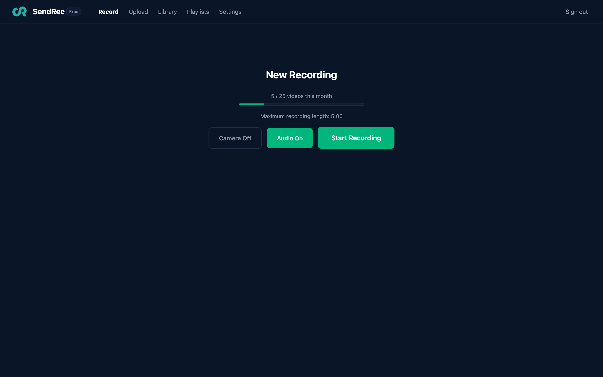
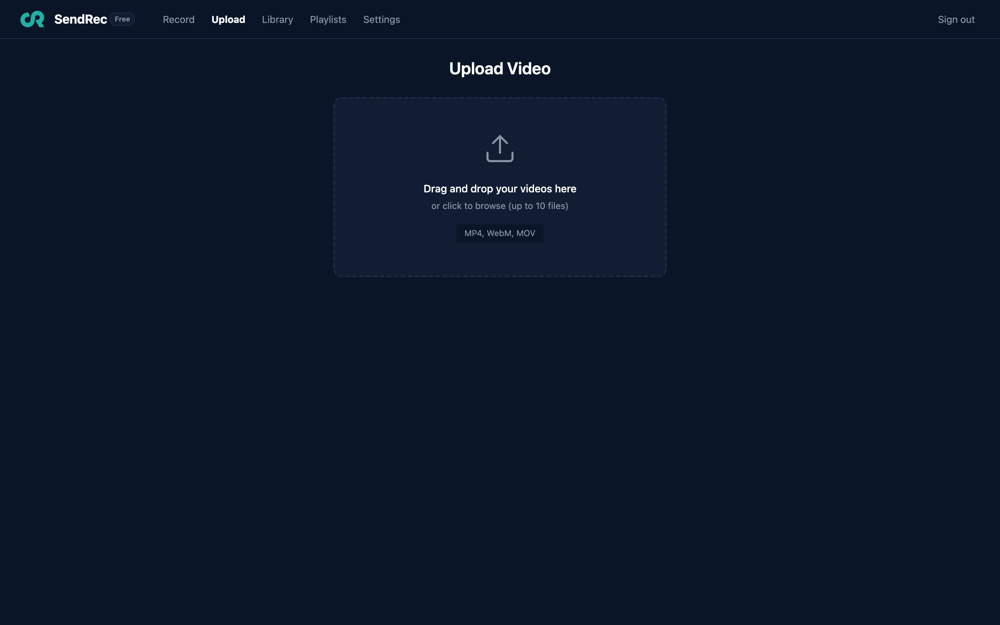
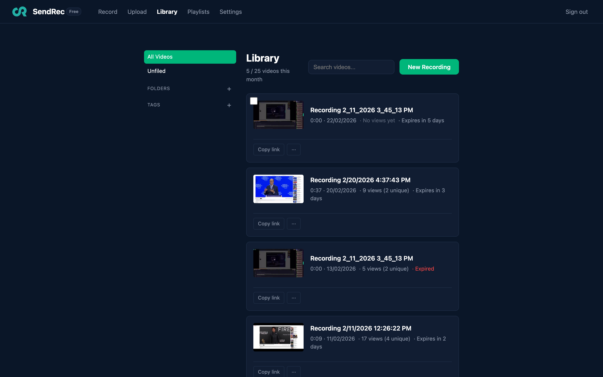
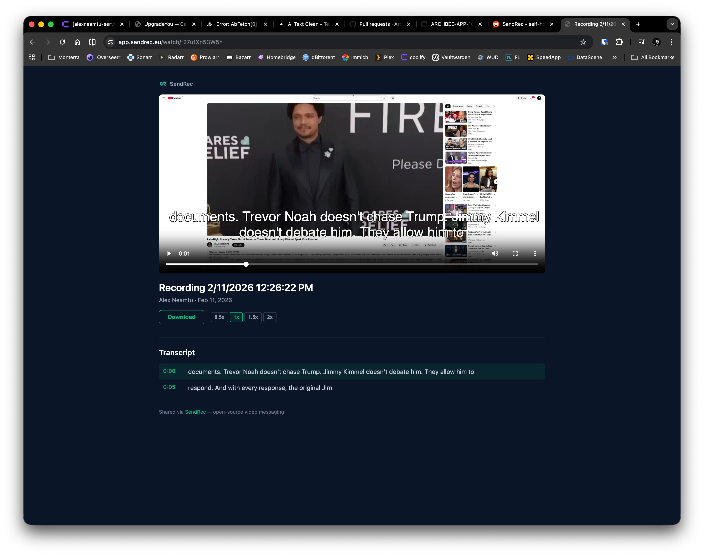
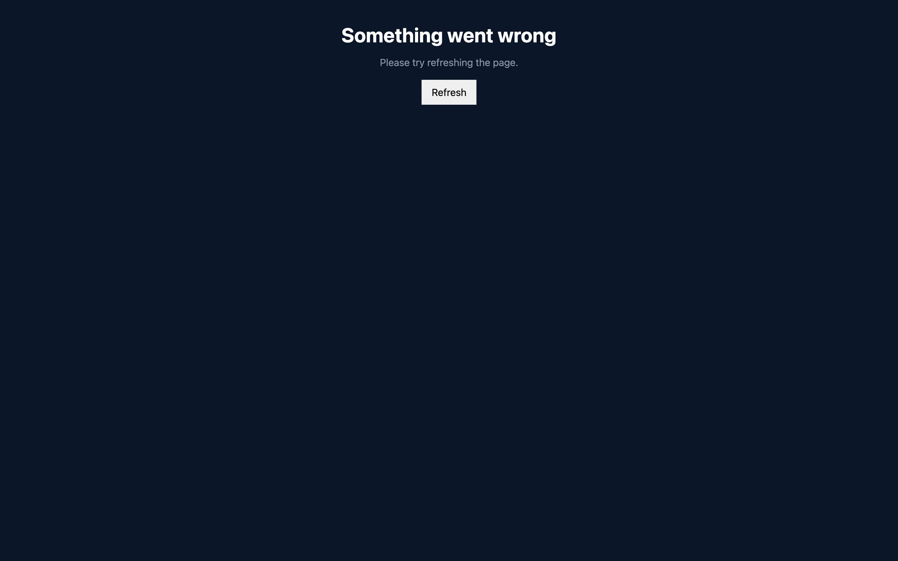

# SendRec

The async video platform built for Europe. Open source, GDPR native, EU hosted.


## What is SendRec?

SendRec is an open-source alternative to Loom for teams that need their data to stay in the EU. Record your screen, share videos with your team, and keep full control of your data.

### Record

Record your screen, camera, or both — directly in the browser. A 3-2-1 countdown gives you time to prepare. Pause and resume, draw annotations live, flip between front and back cameras on mobile.



### Upload

Drag and drop up to 10 videos at once — MP4, WebM, and MOV. Files upload directly to S3 via presigned URLs, and each gets a shareable link instantly.



### Share

Every video gets a shareable link with password protection, expiry dates, and per-video download controls. Trim videos, upload custom thumbnails, and add call-to-action buttons that appear when the video ends.



### Watch

Server-rendered watch pages with AI-generated summaries and chapter markers in the seek bar, a clickable transcript panel, closed captions, timestamped comments, and emoji reactions. SEO-optimized with OpenGraph tags, Twitter Cards, and VideoObject JSON-LD. Embed videos in docs and wikis with a lightweight iframe player.



### Analyze

Per-video analytics with view counts, completion funnel (25/50/75/100%), and CTA click-through rates. Get notified on views, comments, or as a daily digest.



### Features

- **Screen & camera recording** — 3-2-1 countdown, pause/resume, webcam overlay, drawing annotations, mobile front/back camera
- **Video upload** — drag-and-drop up to 10 files at once, MP4/WebM/MOV, per-file progress
- **Automatic transcription** — whisper.cpp, closed captions on watch and embed pages, full-text search
- **Transcript editing** — trim by clicking transcript segments, filler word removal with preview, AI-generated title suggestions
- **Sharing** — expiring or permanent links, password protection, per-video download toggle, custom thumbnails
- **Comments & reactions** — timestamped comments, emoji reactions, configurable modes
- **CTA buttons** — call-to-action overlay on video end with click tracking
- **AI summaries** — AI-generated summaries and chapter markers in the seek bar via any OpenAI-compatible API
- **Viewer analytics** — daily view charts, completion funnel, CTA click-through rates
- **Generic webhooks** — POST events (video created/ready/deleted, viewed, comment, milestone, CTA click) to any URL with HMAC-SHA256 signing, retries, and delivery log
- **Slack notifications** — per-user Slack incoming webhook for view and comment alerts
- **View notifications** — off, views only, comments only, both, or daily digest
- **Embeddable player** — lightweight iframe with captions, CTA, and milestone tracking
- **Custom branding** — logo, colors, footer text, custom CSS injection, per-user defaults with per-video overrides
- **Library** — folders, tags, and playlists; search by title and transcript; batch delete/move/tag; inline title editing
- **Playlists** — curated video collections with custom ordering, shared watch pages with auto-advance, watched badges, password protection, and email gating
- **Dark/light mode** — system preference detection, manual toggle, theme-aware charts
- **Email gate** — require viewer email before watching, per-viewer analytics with email, completion tracking
- **SEO** — OpenGraph tags, Twitter Cards, VideoObject JSON-LD, canonical URLs, robots.txt
- **Subscription billing** — optional Creem integration for free/Pro tiers, webhook-based plan activation, customer portal
- **Integrations** — Nextcloud (oEmbed + API keys), per-user API keys, OpenAPI docs
- **Self-hostable** — single Go binary, Docker Compose, PostgreSQL, S3-compatible storage

## Quick Start

```bash
git clone https://github.com/sendrec/sendrec.git
cd sendrec
cp .env.example .env
docker compose -f docker-compose.dev.yml up --build
```

Open http://localhost:8080, register an account, and start recording.

## Development

**Prerequisites:** Go 1.25+, Node 24+, pnpm, Docker

```bash
# Run the full stack with Docker
make docker-up

# Or run services separately:
make dev-web    # Frontend dev server (port 5173, proxies API to 8080)
make run        # Go server (requires DATABASE_URL, S3 env vars)

# Build everything
make build

# Run tests
make test
```

## Tech Stack

- **Frontend:** React 19, TypeScript 5.9, Vite 7
- **Backend:** Go (single binary, chi router)
- **Database:** PostgreSQL 18
- **Storage:** S3-compatible object storage (Garage for dev and self-hosting)
- **Transcription:** [whisper.cpp](https://github.com/ggerganov/whisper.cpp) (optional, runs server-side)
- **Deployment:** Docker Compose

## Architecture

Single Go binary that:
- Serves the React SPA (embedded at build time)
- Handles REST API requests (`/api/*`)
- Serves interactive API documentation (`/api/docs`)
- Renders server-side watch pages with OpenGraph tags, Twitter Cards, and JSON-LD (`/watch/:token`)
- Runs database migrations on startup

Video recordings happen entirely in the browser using `getDisplayMedia` + `MediaRecorder`. Users can also upload existing video files (MP4, WebM, MOV) via drag-and-drop. Files upload directly to S3 via presigned URLs — the server never touches video bytes.

After upload, the server generates a thumbnail with ffmpeg and enqueues the video for transcription with [whisper.cpp](https://github.com/ggerganov/whisper.cpp). Transcripts are stored as VTT subtitles and a clickable segment panel on the watch page. Transcription is optional — if the whisper model is not available, it is silently skipped.

## Self-Hosting

SendRec runs on a single server with Docker Compose. See the **[Self-Hosting Guide](SELF-HOSTING.md)** for full setup instructions, including:

- Production Docker Compose configuration
- Environment variables reference
- Reverse proxy setup (Caddy example)
- Enabling transcription with whisper.cpp
- Removing usage limits
- Updating and backups

## API Documentation

Interactive API reference is available at [`/api/docs`](https://app.sendrec.eu/api/docs) (powered by [Scalar](https://github.com/scalar/scalar)). The raw OpenAPI 3.0 spec is at [`/api/docs/openapi.yaml`](https://app.sendrec.eu/api/docs/openapi.yaml).

## Deployment

Deployments are automated via GitHub Actions. Three environments are available:

| Environment | URL | Trigger |
|-------------|-----|---------|
| **Preview** | `pr-{N}.app.sendrec.eu` | PR opened/updated (write-access authors only, max 3 concurrent) |
| **Staging** | `staging.app.sendrec.eu` | Push to `main` |
| **Production** | `app.sendrec.eu` | Push a git tag (`v*`) |

### Deploying to production

1. Merge your PR to `main` — staging deploys automatically
2. Verify on `staging.app.sendrec.eu`
3. Tag and push:
   ```bash
   git tag v1.0.0
   git push origin v1.0.0
   ```

Preview environments are cleaned up automatically when the PR is closed.

## License

SendRec is licensed under the [GNU Affero General Public License v3.0](LICENSE).

## Links

- **Website:** [sendrec.eu](https://sendrec.eu)
- **Changelog:** [GitHub Releases](https://github.com/sendrec/sendrec/releases)
- **API docs:** [app.sendrec.eu/api/docs](https://app.sendrec.eu/api/docs)
- **Blog:** [sendrec.eu/blog](https://sendrec.eu/blog)
- **Email:** hello@sendrec.eu
