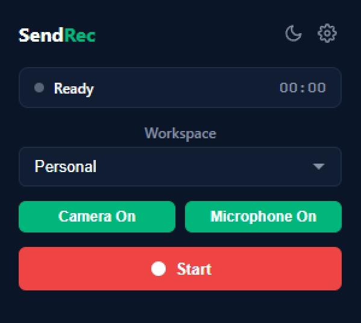
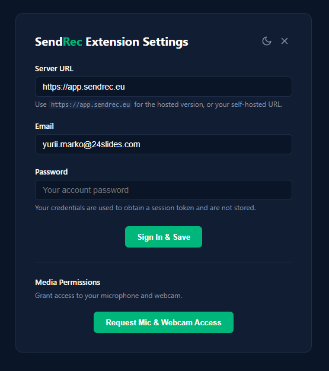

# SendRec Chrome Extension

A Chrome/Chromium browser extension for recording your screen and uploading directly to [SendRec](https://app.sendrec.eu) or a self-hosted instance.




## Features

- **Screen Recording** — Record entire screen, specific tab, or webcam
- **Webcam overlay** — Record screen + webcam simultaneously
- **Audio capture** — Microphone and/or system audio
- **Pause/Resume** — Pause and resume recordings
- **Direct upload** — Uploads to SendRec via presigned URLs (no server proxy)
- **Self-hosted support** — Configure any SendRec-compatible server URL
- **Share link** — Get a share link immediately after upload

## Installation (Developer Mode)

1. Open Chrome and navigate to `chrome://extensions/`

2. Enable **Developer mode** (toggle in top-right)

3. Click **Load unpacked** and select this `sendrec-chrome-extension` folder

4. Click the extension icon and go to **Settings** to configure:
   - **Server URL**: `https://app.sendrec.eu` (or your self-hosted URL)
   - **Email & Password**: Your SendRec account credentials

## Usage

1. Click the SendRec extension icon in your toolbar
2. Select recording source (Screen, Tab, Webcam, or combinations)
3. Toggle audio options (Microphone / System Audio)
4. Click **Start** to begin recording
5. Use **Pause** to temporarily pause, **Stop** to finish
6. The recording automatically uploads and provides a share link

## Configuration

| Setting | Description |
|---------|-------------|
| Server URL | Your SendRec instance URL (e.g., `https://app.sendrec.eu`) |
| Email | Your SendRec account email |
| Password | Your account password (used to obtain a session token, not stored) |
| Default Source | Pre-selected recording source |
| Default Options | Webcam, Microphone, and System Audio defaults |

## Authentication

The extension uses your SendRec email and password to obtain a JWT session token. The token is stored locally and auto-refreshes when expired. Your password is not stored — only the session token is kept.

## Architecture

```
sendrec-chrome-extension/
├── manifest.json          # Extension manifest (MV3)
├── background/
│   └── background.js      # Service worker: state management & upload logic
├── offscreen/
│   ├── offscreen.html     # Offscreen document (required for MediaRecorder in MV3)
│   └── offscreen.js       # Recording logic (getUserMedia/getDisplayMedia)
├── popup/
│   ├── popup.html         # Extension popup UI
│   ├── popup.css          # Popup styles
│   └── popup.js           # Popup logic & state display
├── options/
│   ├── options.html       # Settings page
│   ├── options.css        # Settings styles
│   └── options.js         # Settings logic & connection test
└── icons/                 # Extension icons
```

## Upload Flow

1. `POST /api/videos` — Creates a video record, returns presigned upload URL
2. `PUT <presigned-url>` — Uploads the recording directly to S3-compatible storage
3. `PATCH /api/videos/{id}` — Marks the video as ready for processing

## Browser Compatibility

Works in all Chromium-based browsers:
- Google Chrome
- Microsoft Edge
- Brave
- Opera
- Vivaldi

## Permissions

- `storage` — Save extension settings
- `tabCapture` — Record browser tabs
- `offscreen` — MediaRecorder access (required in Manifest V3)
- Host permissions — Communicate with your SendRec server

## Troubleshooting

- **"Not signed in"** — Go to extension settings and sign in with your email and password
- **"Session expired"** — Re-open settings and sign in again
- **Screen sharing prompt doesn't appear** — Make sure you're not in an incognito window
- **No system audio** — System audio capture requires selecting "Share tab audio" or "Share system audio" in the Chrome dialog
