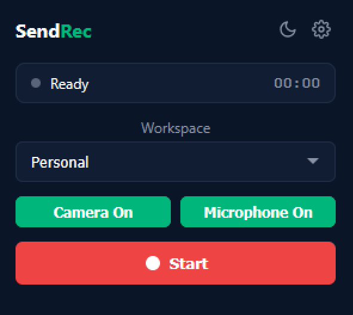
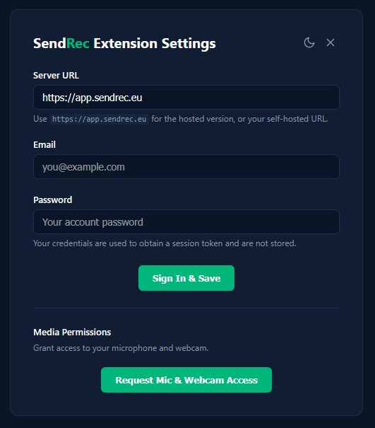

# SendRec Firefox Extension

A Firefox browser extension for recording your screen and uploading directly to [SendRec](https://app.sendrec.eu) or a self-hosted instance.





## Features

- **Screen Recording** — Record entire screen or specific tab
- **Webcam overlay** — Record screen + webcam simultaneously
- **Audio capture** — Microphone and/or system audio
- **Pause/Resume** — Pause and resume recordings
- **Direct upload** — Uploads to SendRec via presigned URLs (no server proxy)
- **Self-hosted support** — Configure any SendRec-compatible server URL
- **Share link** — Get a share link immediately after upload
- **Dark/Light theme** — Matches the SendRec app design

## Installation (Temporary — Developer Mode)

1. Open Firefox and navigate to `about:debugging`

2. Click **"This Firefox"** in the left sidebar

3. Click **"Load Temporary Add-on..."** and select the `manifest.json` file from this folder

4. Click the extension icon and go to **Settings** to configure:
   - **Server URL**: `https://app.sendrec.eu` (or your self-hosted URL)
   - **Email & Password**: Your SendRec account credentials

> **Note:** Temporary add-ons are removed when Firefox restarts. Use the permanent installation method below to persist the extension across sessions.

## Installation (Permanent)

To load the extension permanently without signing it through AMO:

> **Important:** Regular Firefox **cannot** install unsigned extensions — you must use **Firefox Developer Edition**, **Firefox ESR**, or **Firefox Nightly**. Download Firefox Developer Edition from: https://www.mozilla.org/firefox/developer/

1. Install **Firefox Developer Edition** (or ESR / Nightly)

2. Navigate to `about:config` and set:
   ```
   xpinstall.signatures.required = false
   ```

3. Package the extension into an `.xpi` file:

   **Linux/macOS:**
   ```bash
   cd sendrec-firefox-extension
   zip -r sendrec.xpi . -x ".*" -x "README.md"
   ```

   **Windows (PowerShell):**
   ```powershell
   Compress-Archive -Path .\* -DestinationPath sendrec.zip -Force
   Rename-Item sendrec.zip sendrec.xpi -Force
   ```

4. Open Firefox Developer Edition and navigate to `about:addons`

5. Click the gear icon (⚙) → **"Install Add-on From File..."**

7. Select the `sendrec.xpi` file

The extension will now persist across browser restarts.

## Usage

1. Click the SendRec extension icon in your toolbar
2. Select recording source (Screen or Current Tab)
3. Toggle options (Webcam / Microphone / System Audio)
4. Click **Start** to begin recording
5. Use **Pause** to temporarily pause, **Stop** to finish
6. The recording automatically uploads and provides a share link

## Configuration

| Setting | Description |
|---------|-------------|
| Server URL | Your SendRec instance URL (e.g., `https://app.sendrec.eu`) |
| Email | Your SendRec account email |
| Password | Your account password (used to obtain a session token, not stored) |
| Default Source | Pre-selected recording source |
| Default Options | Webcam, Microphone, and System Audio defaults |

## Authentication

The extension uses your SendRec email and password to obtain a JWT session token. The token is stored locally and auto-refreshes when expired. Your password is not stored — only the session token is kept.

## Architecture

```
sendrec-firefox-extension/
├── manifest.json          # Extension manifest (MV2 with gecko settings)
├── background/
│   └── background.js      # Background script: recording, state, upload, auth
├── popup/
│   ├── popup.html         # Extension popup UI
│   ├── popup.css          # Popup styles
│   └── popup.js           # Popup logic & state display
├── options/
│   ├── options.html       # Settings page
│   ├── options.css        # Settings styles
│   └── options.js         # Settings logic & login
├── shared/
│   └── theme.js           # Dark/light theme toggle
└── icons/                 # Extension icons
```

## Upload Flow

1. `POST /api/videos` — Creates a video record, returns presigned upload URL
2. `PUT <presigned-url>` — Uploads the recording directly to S3-compatible storage
3. `PATCH /api/videos/{id}` — Marks the video as ready for processing

## Permissions

- `storage` — Save extension settings and session token
- `tabs` — Open settings page
- Host permissions — Communicate with your SendRec server

## Troubleshooting

- **"Not signed in"** — Go to extension settings and sign in with your email and password
- **"Session expired"** — Re-open settings and sign in again
- **Screen sharing prompt doesn't appear** — Make sure you're not in a private window
- **No system audio** — System audio capture support varies by OS in Firefox
- **No webcam overlay on recording** — Latest versions of Firefox may not show the webcam feed during recording due to changes in how `getUserMedia` works in extension background contexts. Try using an earlier Firefox version or Firefox ESR if webcam overlay is required.
